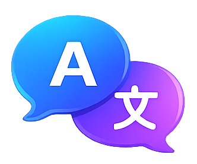
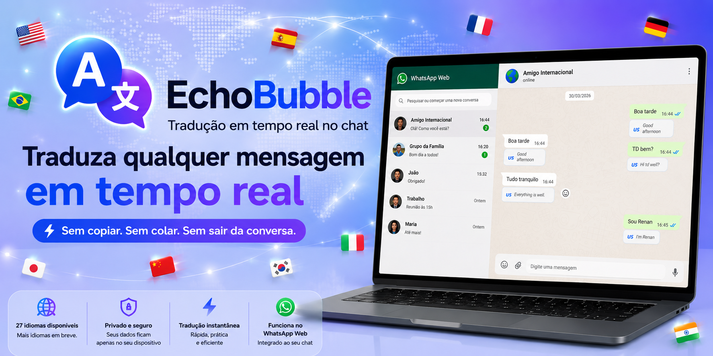

  

<b>Tradução automática em tempo real para o WhatsApp Web.</b> 
Converse em qualquer idioma sem sair do chat.

---

## ✨ Funcionalidades

- 🌍 Tradução automática das mensagens
- 💬 Tradução exibida abaixo de cada mensagem
- ⚡ Tradução em tempo real
- 🎯 Interface leve e discreta
- 🧠 Cache inteligente de traduções
- 🌐 Suporte para diversos idiomas
- 🖥️ Desenvolvido para WhatsApp Web

---

## 📷 Demonstração

  

---

## 🌎 Idiomas

Atualmente o EchoBubble suporta **27 idiomas**.

Novos idiomas serão adicionados nas próximas versões.

---

## 📌 Tecnologias

- JavaScript
- HTML
- CSS
- Chrome Extensions Manifest V3
- MyMemory Translation API

---

## 📅 Roadmap

- ✅ Tradução automática
- ✅ Seleção de idioma
- ✅ Cache inteligente
- 🔄 Mais idiomas
- 🔄 Mais APIs de tradução
- 🔄 Melhorias de desempenho
- 🔄 Publicação na Chrome Web Store

---

## 👨‍💻 Autor

Desenvolvido por **Renan Casagrande**.

Projeto open source.
